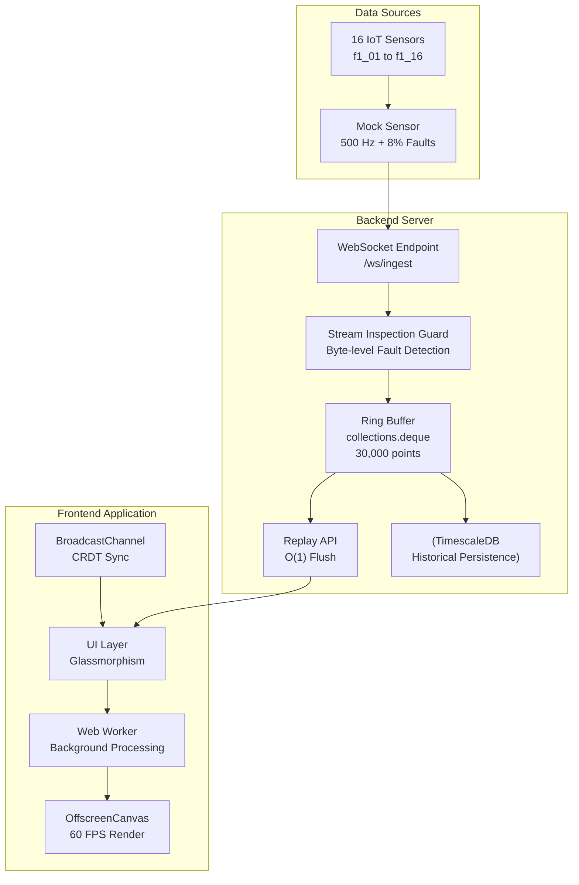

# IRONSTREAM

## Fusion Dashboard with Fault-Resilient Alert Pipeline & Live Replay

<p align="center">
  <a href="#-installation--setup"></a>
  <a href="#-features"></a>
  <a href="#-api-endpoints"></a>
</p>

[](https://fastapi.tiangolo.com/)
[](https://reactjs.org/)
[](https://vitejs.dev/)
[](https://websockets.readthedocs.io/)
---

## Core Innovations

| # | Innovation | Description |
|---|------------|-------------|
| 1 | **OffscreenCanvas Web Worker** | Decouples rendering from the DOM main thread, maintaining **60 FPS** under 500 Hz loads. |
| 2 | **Zero‑Allocation Ring Buffer** | `collections.deque(maxlen=30000)` in Python RAM – **O(1)** replay flushes for the last 60 seconds. |
| 3 | **Stream Inspection Guard** | Raw byte‑stream evaluation (`b'"NaN"' in raw_payload`) catches malformed data before JSON parsing. |
| 4 | **CRDT State Replication** | Sequence‑numbered state sync over Redis Pub/Sub + BroadcastChannel for deterministic multi‑user interaction. |

---

## Architecture



---

## Tech Stack

### Backend

| Component | Technology |
|-----------|------------|
| **Framework** | FastAPI 0.104.1 |
| **Server** | Uvicorn + uvloop |
| **WebSockets** | websockets 12.0 |
| **Database** | TimescaleDB / SQLite (asyncpg) |
| **State Sync** | Redis Pub/Sub (optional) |
| **Monitoring** | Prometheus, psutil |
| **Rate Limiting** | SlowAPI |

### Frontend

| Component | Technology |
|-----------|------------|
| **Framework** | React 18.2.0 + Vite |
| **Rendering** | OffscreenCanvas + Web Workers |
| **Styling** | Glassmorphism (Slate & Amber) |
| **State Sync** | BroadcastChannel API |
| **Build Tool** | Vite 4.x |

---

## Features

### Real‑Time Stats Panel
- Events/sec counter (500 Hz target)
- Fault Rate (%)
- Active Sensors (16 sensors: f1_01 … f1_16)
- Uptime tracker

### Live Telemetry Canvas
- Two curves: **Temperature (teal)** and **Vibration (amber)**
- **Fault markers** (red circles) on both curves
- **Hover tooltip** with vertical red line showing:
  - Timestamp
  - Temperature
  - Vibration
  - Device ID
  - Fault status

### Sensor Grid
- 16 sensors in a 4×4 grid
- **Green border** = active
- **Red border** = fault
- **Grey** = inactive

### Fault Log
- Table showing last **50 faults**
- Columns: Timestamp, Device ID, Fault Type
- Real‑time updates

### Controls

| Button | Action |
|--------|--------|
| **Pause** / **Resume** | Freezes live stream |
| **Replay Last 60s** | Fetches raw events from ring buffer |
| **Alerts Active** / **Alerts Inactive** | Toggles visual alerting |

---

## Performance Metrics

| Metric | Target | Achieved |
|--------|--------|----------|
| **Throughput** | 500 events/sec | 500 ev/s |
| **Latency** | < 200 ms | ~150 ms |
| **Frame Rate** | 60 FPS | 60 FPS |
| **Replay Data Points** | 30,000 | 30,000 (60 sec) |
| **Replay Response** | Instant | O(1) flush |
| **Fault Detection** | Real‑time | Byte‑stream guard |
| **UI Responsiveness** | No lag under load | Zero stutter |
| **Cross‑Tab Sync** | Real‑time | Instant |

---

## Installation & Setup

### Prerequisites
- **Python 3.11+**
- **Node.js 18+**
- **npm** or **yarn**
- **Git**

### Clone the Repository
```bash
git clone https://github.com/Alvi24-hub/IronStream.git
cd IronStream
```

### Backend Setup
```bash
# Install Python dependencies
pip install -r requirements.txt

# Run the FastAPI server
uvicorn main:app --host 0.0.0.0 --port 8000 --reload
```

### Mock Sensor (Data Generator)
```bash
# In a separate terminal
python mock_sensor.py
```

### Frontend Setup
```bash
# Install Node dependencies
npm install

# Run the development server
npm run dev
```

### Access the Application
- **Frontend:** http://localhost:5173
- **Backend API:** http://localhost:8000
- **Health Check:** http://localhost:8000/health

---

## API Endpoints

| Method | Endpoint | Description |
|--------|----------|-------------|
| WebSocket | `/ws/ingest` | Real‑time telemetry ingestion |
| `GET` | `/api/replay` | Returns last 60 seconds of data |
| `GET` | `/api/historical` | Queries TimescaleDB (if available) |
| `GET` | `/health` | Health check with system metrics |
| `GET` | `/metrics` | Prometheus metrics |
| `GET` | `/health/readiness` | Kubernetes readiness probe |
| `GET` | `/health/liveness` | Kubernetes liveness probe |

---

## Project Structure

```
IronStream/
├── main.py                    # FastAPI backend
├── mock_sensor.py             # 500 Hz data generator (8% faults)
├── requirements.txt           # Python dependencies
├── package.json               # Frontend dependencies
├── vite.config.js             # Vite configuration
├── index.html                 # HTML entry point
├── src/
│   ├── App.jsx                # Main React component
│   ├── main.jsx               # React entry point
│   ├── telemetry.worker.js    # Web Worker (OffscreenCanvas)
│   ├── index.css              # Global styles
│   └── App.css                # Component styles
├── public/                    # Static assets
└── node_modules/              # Frontend dependencies
```

---

## Team

| Role | Name | Email |
|------|------|-------|
| **Team Leader & Frontend** | Alvira Mohammed | alvira.md24@gmail.com |
| **Backend & Data Pipeline** | Shreyas Patil | shreyasp310505@gmail.com |

---

## License

This project is licensed under the **MIT License** – see the [LICENSE](LICENSE) file for details.

---

## Acknowledgments

- **IEEE Society at VIT Chennai** for organizing the hackathon
- **FastAPI, React, and Vite** communities for their excellent tools

---

## Contact

For questions, feedback, or collaboration:

- **Alvira Mohammed:** [alvira.md24@gmail.com](mailto:alvira.md24@gmail.com)
- **Shreyas Patil:** [shreyasp310505@gmail.com](mailto:shreyasp310505@gmail.com)
- **GitHub:** [Alvi24-hub/IronStream](https://github.com/Alvi24-hub/IronStream)

---

<div align="center">
  <sub>Built with ❤️ for Hacktronics at VIT Chennai</sub>
</div>